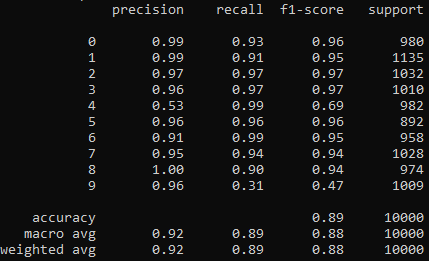

## LeNet: Recognizing Handwritten Digits
LeNet is a convolutional neural network structure proposed by LeCun et al. in 1998,. In general, LeNet refers to LeNet-5 and is a simple convolutional neural network. Convolutional neural networks are a kind of feed-forward neural network whose artificial neurons can respond to a part of the surrounding cells in the coverage range and perform well in large-scale image processing.

This is the simplest implementation of the paper "[Gradient-based learning applied to document recognition](http://vision.stanford.edu/cs598_spring07/papers/Lecun98.pdf)" in PyTorch.\
Have a try with artificial intelligence!\
Feel free to ask anything!

### 1. Model Architecture


### 2. Requirements
- Python3
- Pytorch
- Tensorboard

### 3. How to train & eval
- Training:
```
cd 004_Lenet
python train.py --config=configs/lenet.yaml
```
or
```
cd 004_Lenet
python3 train.py --config=configs/lenet.yaml
```
- Evaluate:
```
cd 004_Lenet
python eval.py --config=configs/lenet.yaml
```
or
```
cd 004_Lenet
python3 eval.py --config=configs/lenet.yaml
```

### 4. Results
Digital MNIST dataset:\
